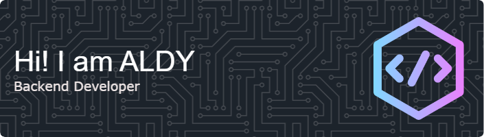

<h1 align="left">Hello There! 👋</h1>

###

<h3 align="left">👩‍💻  About Me</h3>

###

I'm ALDY, Undergraduate at Information Systems University Terbuka | Back-End Developer Enthusiast | Web Developer Enthusiast  - 🔭 I’m open to "Backend Development" - 📚 I'm currently learning Fiber & PERN

###

<h3 align="left">🛠 Language and tools</h3>

###

  
  
  
  
  
  
  
  
  
  
  
  
  
  
  
  
  
  
  
  
  

###

###

<h3 align="left">Connect Me</h3>

###

  
  

###

<!--
**ALDY-Tech/ALDY-Tech** is a ✨ _special_ ✨ repository because its `README.md` (this file) appears on your GitHub profile.

Here are some ideas to get you started:

- 🔭 I’m currently working on ...
- 🌱 I’m currently learning ...
- 👯 I’m looking to collaborate on ...
- 🤔 I’m looking for help with ...
- 💬 Ask me about ...
- 📫 How to reach me: ...
- 😄 Pronouns: ...
- ⚡ Fun fact: ...
-->
